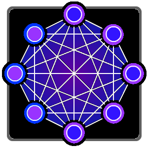

# Rafko 

A deep learning Framework extended with per Neuron memory capabilities with focus on
architecture search through training.
The Framework is of a server-client architecture, in which  a deep learning server provides
calculation slots for different clients. The calculations are neural network related,
such as solving a network, calculating gradients and updating a network, etc..

## Structure Overview:
 - **src/main/cxx:** Contains the Source code for the Neural Network and support libraries
   - **rafko_gym:** Building blocks of network Training
   - **rafko_mainframe:** A basic incomplete implementation if a deep learning service based on the library
   - **rafko_net:** Building blocks of a Neural Network
   - **rafko_utilities:** Various Utility implementations not strictly part of the library in topic
   - **test:** Test suites for checking consistency and corect behavior
 - **src/main/java:** Let's not look in there yet..
 - **/res:** miscellianeous resources

## Build Dependencies:
The Library is built upon [Googles protocol buffer library](https://github.com/protocolbuffers/protobuf) and the services are using [GRPC](https://github.com/grpc/grpc); Tested with the [Catch Framework](https://github.com/catchorg/Catch2).

- Building the Network Library only requires a working installation of protobuf
- Building the mainframe requires a working installation of GRPC

### Unix dependencies:
- CMake
- pkg-conf
- build-essential

### Windows dependencies:

Probably much more... It might work, but it's not supported currently.
